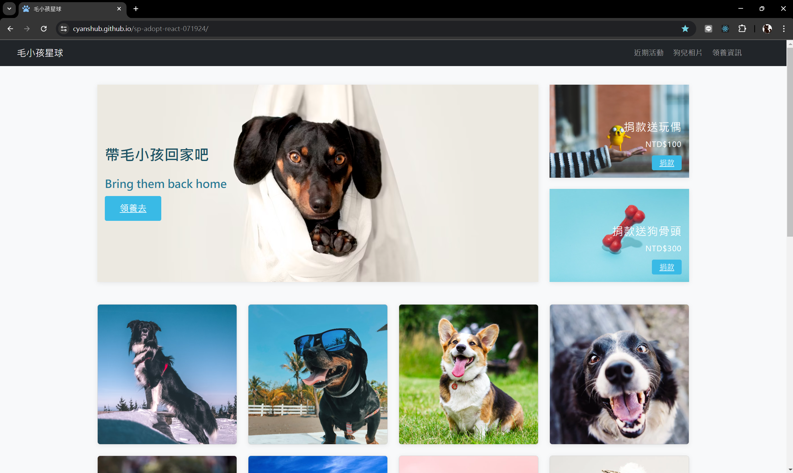

# 毛小孩星球 React 專案

## 介紹

- 這是使用 React 前端框架完成的專案
- 專案採用了 TypeScript (JavaScript 的超集)，為資料提供型別支持，改善了 JavaScript 原本型別不準確的問題
- 頁面內容是個人初學 CSS 切版時的練習作業
- 當時的作業是拆成 `index.html` 和 `style.css` 兩個檔案，並把程式碼全部寫在一起
- 後來個人有在程式碼的寫法上進行優化: 包含 Sass 預處理、Express-handlebars 畫面渲染等等
- HTML 元素包含 `header`、`banner`、`album`、`adoption`、`footer` 等區塊
- 之前在學習 Node.js 時，曾練習使用 Express-handlebars 把 HTML 拆分成不同的 handlebars 檔案
- 此專案改用 React 前端框架進行優化:
  - 採用 React 的路由設置架構，並將 HTML 拆成數個 UI 組件
  - 運用 React 技術重構 Node.js 的 Express-handlebars 的畫面

## 使用 React + TypeScript + Vite

此專案的 React 是使用 [Vite](https://vitejs.dev/) 搭建的現代前端開發工具。Vite 提供了快速的 HMR 更新和更短的構建時間，使開發過程更高效。使用 Vite 作為專案的構建工具，可享受以下優勢:

- **快速啟動**：Vite 使用原生 ES 模組，使得啟動時間非常迅速
- **即時更新**：支持 HMR，即時反映代碼變更，提升開發效率
- **高效構建**：利用 Vite 的構建工具，快速生成優化的生產版本

目前有兩個官方的插件可供使用：

- [@vitejs/plugin-react](https://github.com/vitejs/vite-plugin-react/blob/main/packages/plugin-react/README.md) 使用 [Babel](https://babeljs.io/) 來進行 Refresh
- [@vitejs/plugin-react-swc](https://github.com/vitejs/vite-plugin-react-swc) 使用 [SWC](https://swc.rs/) 來進行 Fast Refresh

## GitHub Actions 自動化

此專案中使用了 GitHub Actions 來實現 CI/CD（持續集成和持續部署）流程。以下是一些自動化處理的技術介紹:

- **自動測試**：每次提交代碼時，自動運行測試來確保代碼的正確性
- **自動部署**：在代碼通過測試後，自動將最新版本部署到伺服器或靜態網站託管服務（如 GitHub Pages）
- **工作流程文件**：在 `.github/workflows` 目錄下定義工作流程文件（例如 `deploy.yml`），來配置自動化任務

這個工作流程在每次推送到指定分支分支時會執行（例如 `main`），完成以下步驟:

1. 拉取代碼
2. 安裝依賴套件
3. 構建專案
4. 將構建後的文件部署到 GitHub Pages

通過這些自動化處理，提高專案開發效率和程式碼品質。
